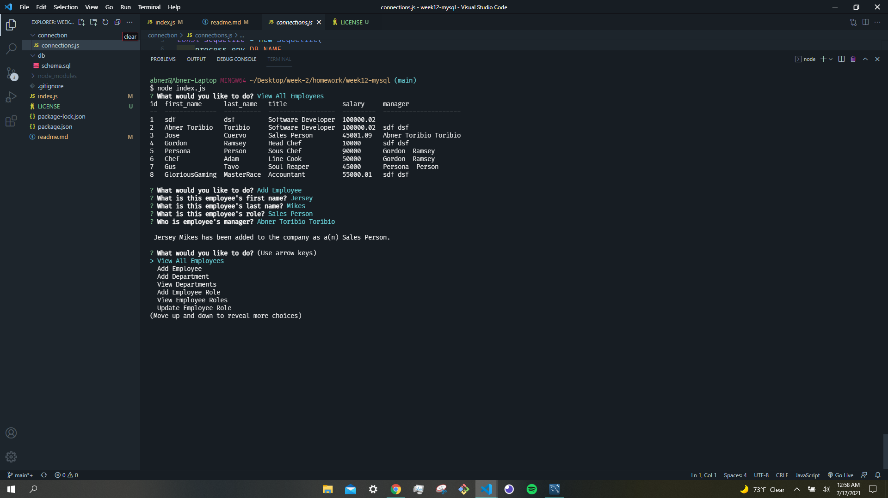

## Employee Tracker CLI App
Made by Abner Toribio

## License

This project covered under a MIT License. 

## Table of contents 

[Description](#Description)

[Tests](#Tests)

[Usage](#Usage)

[Contributions](#Contributions)

[Licenses](#License) 

## Description

This is a command line interface that allows a person to keep track of employees by inputing data such as salary, department, and manager information.

Here it is in action: https://drive.google.com/file/d/17dxecByxUngnvfgH32V9F4nFkTZiQiZt/view

## Tests

THe following instructions are how to run tests on this program: Clone this repo, run 'npm install',  after that all that is left is to type in 'node index.js' into the console, and the user will be prompted with a menu. 

## Usage 

To keep track of employee information such as salary, managers and department information.

## Contributions
No contributions at this moment.

## Questions

If you have any questions or concerns, feel free to take a look at my Github: [AbnerTor](https//github.com/AbnerTor) or contact me by email at: abnertoribio@live.com

